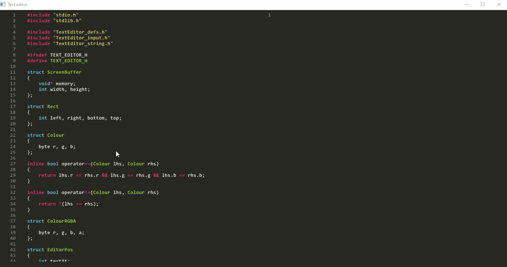
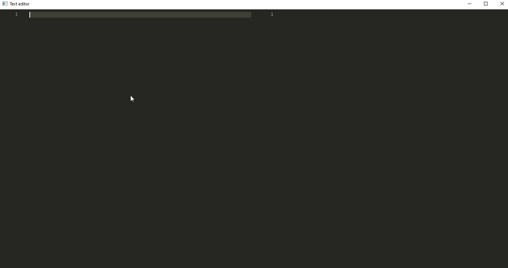

# TextEditor
 A text editor built with C++ and Win32 API. 

# Build
This project is compiled using the MSVC compiler via the command line (information about the command line compiler can be found [here](https://learn.microsoft.com/en-us/cpp/build/building-on-the-command-line?view=msvc-170)):
 1. Open up a terminal and run `vcvarsall.bat` (this will be located within a visual studio path).
 2. Run the `build.bat` script.

